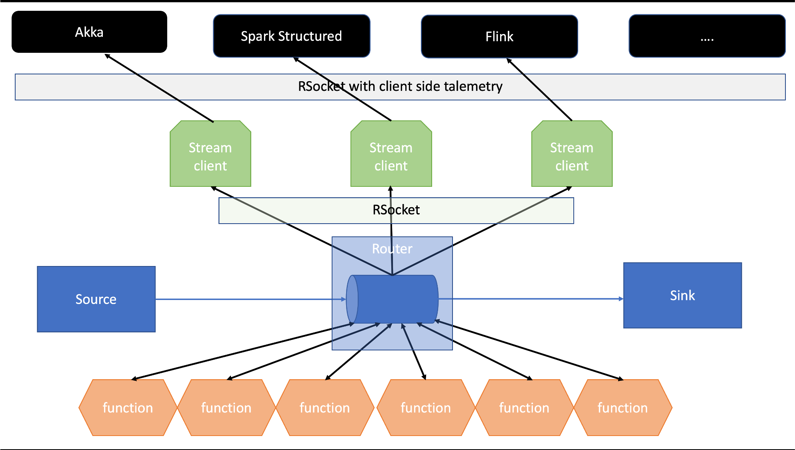

# Open FaaS Router and RSocket Streamer

Kafka based OpenFaas function router, which routes the messages to a function, declaratively. It also provides ability
to stream the messages via RSocket. It also supports client side telemetry. This framework is powered by GraalVM and
deployable on k8s. The framework completely cloud agnostic and native. Function support is language agnostic.

The router has ability to listen to wild card based topic name and dispatch messages stream to function. FaaS provides
on demand the scalable platform with "zero" line of infrastructure as code. Also, the container on which functions runs,
support varieties of configurable environments, ranging from python to java to nodejs and more.

The goal of this framework is to provide relief from a batch oriented framework without compromising on the volume of
data one can process. It will enable end user to think "function" as building block for processing. This framework will
be great help for micro-service orchestration or data (service) orchestration. It uses optioned programing model. Three
fundamental block of this framework are:

- Source
- Processor
- Sink

Its worth mentioning, the framework is inspired from **_"Pipeline architecture"_**. The message transport layer is
configurable, currently kafka used. It will also support standard enterprise integration patterns. The streaming
protocol of choice is RSocket.

The framework will also provide consumable streams to framework like Kafka, Spark structure streams, flink etc. Since
speed is the key, framework has chosen reactive programing model in combination of RSocket protocol.

**_Is it yet another framework?_** The framework is developer "advocate" and does not have opinionation on the choice in
which logic is build, however, optioned about programing model and transport protocol. Just code ....

**_Why not aws lambda or other cloud function?_** The goal of the framework is cloud native and agnostic with the
**_principle_** _code any there and deploy anywhere._

_**Cold vs Hot start of function & router**_ GraalVM provides sub millisecond speed in starting of the container and
container pooling make sure functions are always accessible. This functions will provide hot start.

**_Router Scalability_** Router is build using GraalVM and configurable topic listening capabilities using wild card
pattern. This provides scalability with spped.

Rome was not built in a day, it work in progress, however in true spirit of open source, shares, vital research as and
when it's accomplished.

# Tech stack

- Java 11
- GraalVM
- Maven
- OpenFaas
- Spring Cloud
- Spring native
- Apache Camel
- Minio (aws s3 compatibile support)
- Kafka
- Kubernetes
- Jkube
- RSocket
- Hazelcast Jet (stream progressing)

